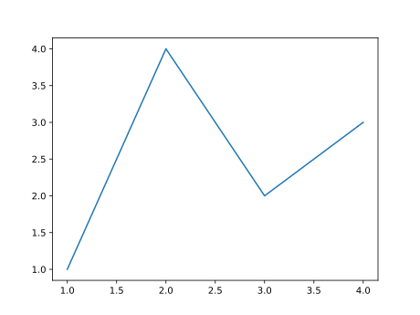

Matplotlib.rs
=============

This is a [Matplotlib][] binding for Rust.  Its interface tries to be
similar to the Matplotlib one (so users knowing the Python version can
easily search for the corresponding functions) but deviating whenever
it makes sense (for example, to specify optional arguments) to have a
nice Rust interface.  Data is _shared_ between Rust and Python (no
copying, no temporary files).

This library is _work in progress_.


Non Rust dependencies
---------------------

The binding is made using [PyO3][], thus you “[need to ensure that
your Python installation contains a shared library][shared-lib]”.  Of
course you also need [Matplotlib][] to be installed.

If you installed Python and matplotlib using
[anaconda](https://www.anaconda.com/), you must use [conda
activate](https://docs.conda.io/projects/conda/en/latest/dev-guide/deep-dives/activation.html#conda-activate) to
make sure the `PATH` is correct and also set `LD_LIBRARY_PATH` (on
Unix) or `DYLD_LIBRARY_PATH` (on MacOSX) to the directory containing
the Python shared library.  For example, in a bash shell:

```bash
eval "$(conda shell.bash activate)"
export LD_LIBRARY_PATH=$CONDA_PREFIX/lib
```


A basic example
---------------

```rust
use matplotlib as plt;

fn main() -> Result<(), Box<dyn std::error::Error>> {
    let (fig, [[mut ax]]) = plt::subplots()?;
    ax.xy(&[1., 2., 3., 4.], &[1., 4., 2., 3.]).plot();
    fig.save().to_file("basic_example.svg")?;
    Ok(())
}
```





[Matplotlib]: https://matplotlib.org/
[IntoIterator]: https://doc.rust-lang.org/std/iter/trait.IntoIterator.html
[PyO3]: https://crates.io/crates/pyo3
[shared-lib]: https://crates.io/crates/pyo3#user-content-using-python-from-rust
